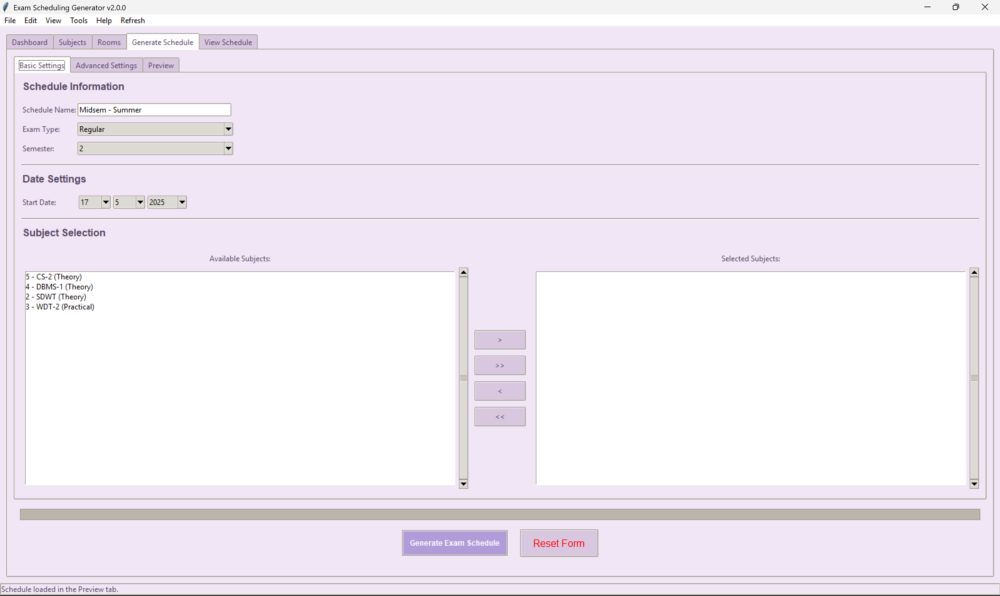

# Exam Scheduling Generator


A comprehensive application for educational institutions to generate and manage optimized exam schedules using constraint programming. This application uses MySQL database for robust data storage and management, featuring an intuitive GUI built with tkinter.

## Overview

The Exam Scheduling Generator is a powerful desktop application designed to simplify the complex task of creating exam schedules while considering various constraints such as room availability, subject requirements, and scheduling preferences. Built with Python and tkinter, it provides an intuitive interface for managing subjects, rooms, and schedules.



## Features

### Subject Management
- Add, edit, and delete subjects with detailed information (course code, name, type, semester, etc.)
- Assign subjects to specific semesters
- Import and export subject lists in CSV format
- Export subjects to PDF with IDs and details

### Room Management
- Manage examination rooms and their capacities
- Categorize rooms by type (lecture hall, lab, etc.)
- Import and export room data
- Export room details to PDF including room IDs

### Schedule Generation
- Create optimized exam schedules using Google OR-Tools constraint programming
- Configure exam parameters (start date, exam types, gap between exams)
- Allocate rooms for exams based on capacity and type
- Handle different exam types (theory, practical, internal, external)
- Skip scheduling exams on Sundays (automatic feature)
- Set custom gaps between difficult exams
- Configurable time slots for different exam types
- Option to allow multiple exams in the same room on the same day

### Schedule Visualization
- View schedules in list or calendar format
- Filter and sort schedule items
- Edit existing schedule items
- Add new items to existing schedules
- Delete schedule items via context menu

### Export Options
- Export schedules to PDF with customizable templates
- Export schedules to CSV format
- Print functionality via PDF export

### User Interface Enhancements
- Font selection for customizing application appearance
- Zoom controls for better readability (zoom in, zoom out, reset zoom)
- Status bar with helpful information that can be toggled on/off
- Theme customization with 12 different visual themes
- Comprehensive help documentation with tabbed interface
- Keyboard shortcuts for all menu items
- Quick access tools menu (Notepad, Calculator, File Explorer, Word, Excel, Web Browser, Email)
- Context menus for common operations
- Tabbed interface for easy navigation between application sections
- Dashboard with summary statistics and quick access to main functions

## Technical Details

### Technologies Used
- **Python 3.x**: Core programming language
- **tkinter**: GUI framework with ttk themed widgets
- **Google OR-Tools**: Constraint programming for schedule optimization
- **MySQL**: Database for storing subjects, rooms, and schedules
- **mysql-connector-python**: MySQL database connectivity
- **Pandas**: Data manipulation for imports/exports
- **ReportLab**: PDF generation with customizable templates
- **Matplotlib**: Schedule visualizations and calendar view
- **PIL/Pillow**: Image handling for logos and UI elements
- **configparser**: Configuration file management

### System Requirements
- Python 3.6 or higher
- MySQL Server 5.7 or higher
- Required Python packages (see requirements.txt)
- Windows operating system (for full functionality of the Tools menu)
- 1024x768 or higher screen resolution (1200x800 recommended)

## Installation

1. Clone the repository or download the source code
   ```
   git clone https://github.com/username/exam-scheduling-generator.git
   ```

2. Install required dependencies
   ```
   pip install -r requirements.txt
   ```
   
   The requirements.txt file includes all necessary dependencies:
   - mysql-connector-python: For MySQL database connectivity
   - pandas: For data manipulation and analysis
   - matplotlib: For visualization components
   - ortools: Google's constraint programming solver
   - reportlab: For PDF generation
   - Pillow: For image processing
   - configparser: For configuration file management

3. Configure the MySQL database
   - Create a MySQL database named `exam_scheduler` (or edit config.ini)
   - Update the database credentials in `config.ini`

4. Run the application
   ```
   python Exam-maker.py
   ```

## Configuration

The application uses a configuration file (`config.ini`) to store database credentials and application preferences:

```ini
[Database]
host = localhost
user = root
password = 
database = exam_scheduler

[Application]
theme = Coffee Cream
autosave_interval = 5
skip_sundays = True
font = Segoe UI
```

You can modify these settings directly in the file or through the application's preferences dialog. The application will create this file with default values if it doesn't exist when the application starts.

### Database Schema

The application uses the following MySQL database tables:

- **subjects**: Stores subject information (code, name, type, semester, difficulty, duration)
- **rooms**: Stores room information (name, type, capacity)
- **schedules**: Stores schedule metadata (name, semester, exam type, start date, configuration)
- **schedule_items**: Stores individual exam items (subject, room, date, time) linked to schedules

## Usage Guide

### Getting Started
1. First, add your subjects using the Subjects tab
2. Add examination rooms in the Rooms tab
3. Navigate to the Generate tab to create a new schedule
4. Configure the schedule parameters and select subjects
5. Generate the schedule and review it in the preview
6. Save your schedule when you're satisfied with it
7. View and manage your schedules in the View Schedule tab

### Keyboard Shortcuts
- **Ctrl+N**: New Schedule
- **Ctrl+O**: Open Schedule
- **Ctrl+S**: Save Schedule
- **Ctrl+I**: Import Subjects
- **Ctrl+E**: Export Subjects
- **Ctrl+P**: Preferences
- **Ctrl+F**: Font Selection
- **Ctrl+L**: List View
- **Ctrl+D**: Calendar View
- **Ctrl+B**: Toggle Status Bar
- **Ctrl+Plus**: Zoom In
- **Ctrl+Minus**: Zoom Out
- **Ctrl+0**: Reset Zoom
- **Ctrl+Alt+N**: Open Notepad
- **Ctrl+Alt+C**: Open Calculator
- **Ctrl+Alt+E**: Open File Explorer
- **Ctrl+Alt+W**: Open Word
- **Ctrl+Alt+X**: Open Excel
- **Ctrl+Alt+B**: Open Web Browser
- **Ctrl+Alt+M**: Open Email Client
- **F1**: Help
- **F2**: About
- **F5**: Refresh

## Troubleshooting

### Database Connection Issues
- Verify your MySQL server is running
- Check your connection credentials in the config.ini file or in Edit → Preferences
- Ensure your MySQL user has appropriate permissions
- Try the 'Test Connection' button to diagnose issues
- Make sure you have created the MySQL database specified in your config.ini file
- The application will attempt to create the database if it doesn't exist, but your MySQL user must have CREATE DATABASE permissions
- Check the console output for detailed error messages if you encounter database issues

### Schedule Generation Problems
- Ensure you have subjects and rooms added to the database
- Check that your constraints aren't too restrictive
- Try with fewer subjects or more rooms if generation fails
- Use the 'Refresh' option (F5) to reload all data

## Screenshots

### Dashboard


### Subjects Management


### Rooms Management


### Advanced Settings


### Schedule Preview


### Calendar View


### List View


### About Dialog


## License

© 2025 Krutarth Raychura. All Rights Reserved.

## Author

Developed by Krutarth Raychura
